# Splines-Based Feature Importance in Kolmogorov-Arnold Networks: A Framework for Supervised Tabular Data Dimensionality Reduction
This repo implement four different methods for feature selection using Kolmogorov Arnold Networks (KAN)
# KAN-Based Feature Selection for Tabular Data

This repository contains the code accompanying the paper:

> KAN-based feature selection for tabular data (arXiv:2509.23366)  
> [https://arxiv.org/abs/2509.23366](https://arxiv.org/abs/2509.23366)

We study Kolmogorov–Arnold Networks (KANs) not just as predictors, but as **engines for feature scoring and selection** on tabular classification and regression tasks.


## Overview

Kolmogorov–Arnold Networks (KANs) replace standard linear weights with **trainable spline functions**, giving each input feature its own small set of 1D splines. This “weights-as-functions” structure naturally exposes feature-wise parameter blocks and gradients that can be turned into **feature-importance scores**.

This repository implements and evaluates four KAN-based selectors:

- **KAN-L1** – Feature score = ℓ₁ norm of spline coefficients attached to each feature.  
- **KAN-L2** – Feature score = ℓ₂ norm of spline coefficients (proxy for the L² “energy” of the learned univariate transformation).  
- **KAN-SI** – *Sensitivity Integral*: average magnitude of the gradient of the KAN output w.r.t. each input feature (global derivative-based sensitivity).  
- **KAN-KO** – *Knock-Out*: increase in validation loss when the spline block of a feature is zeroed out (leave-one-feature-out risk increase).

We compare these to standard baselines:

- **LASSO** (ℓ₁-penalized linear models)  
- **Random Forest importance** / permutation importance  
- **Mutual Information (MI) filters**  
- **SVM-RFE (Recursive Feature Elimination)**


---
## Main Contributions

- 🔍 **KAN-based feature scoring**: Four principled selectors derived directly from KAN spline parameters and gradients (KAN-L1, KAN-L2, KAN-SI, KAN-KO).
- 📊 **Systematic evaluation**: Leakage-safe cross-validation across multiple predictors (Logistic Regression, Ridge, Random Forest, Gradient Boosted Trees, XGBoost) and feature-retention levels (e.g., 20%, 40%, 60%).
- 🧪 **Robustness analyses**:
  - ### Predictive performance (macro-F1 for classification, R² for regression).
  
 **Classification (F1)**

<p float="left">
  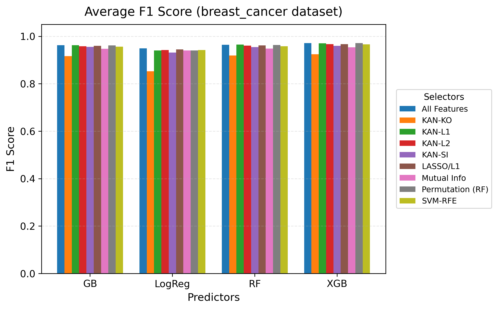
  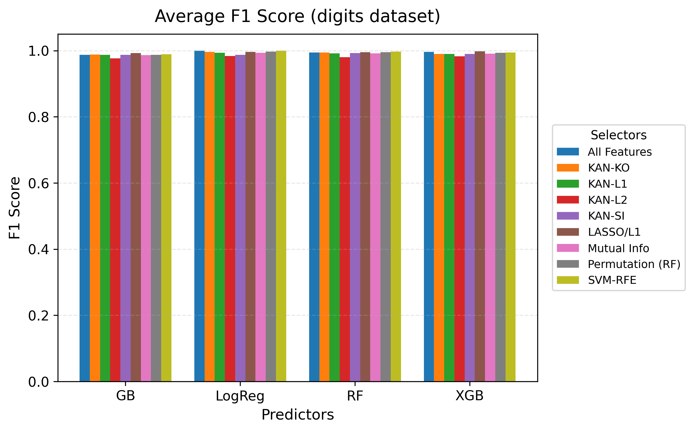
</p>

<p float="left">
  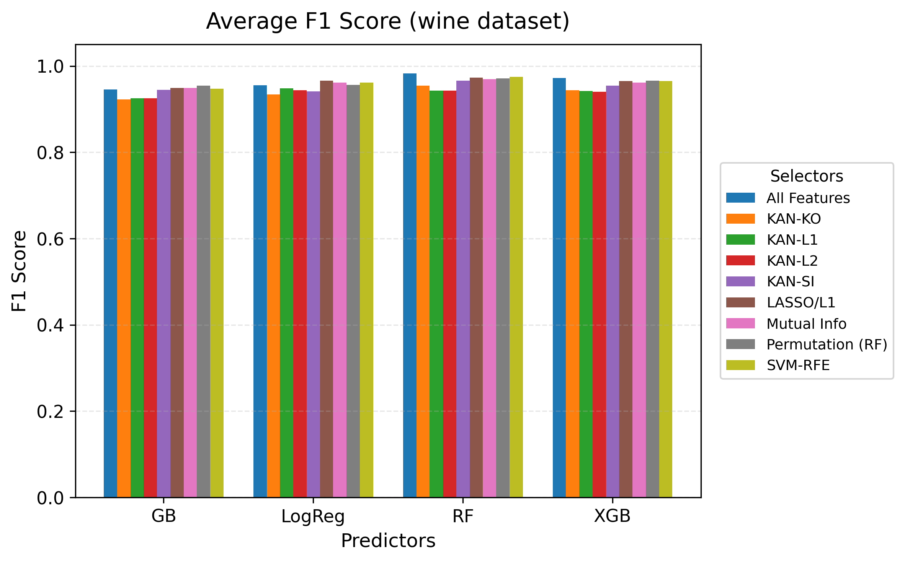
  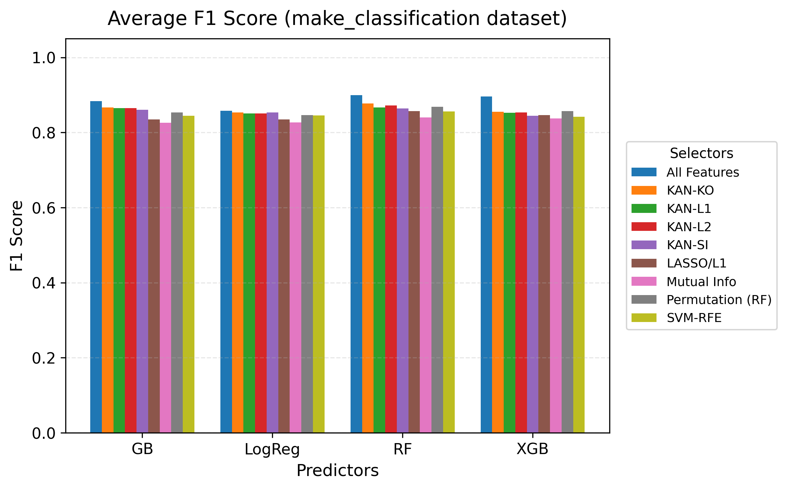
</p>

**Regression (R²)**

<p float="left">
  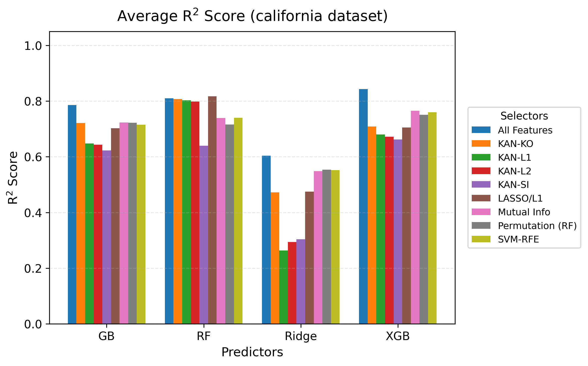
  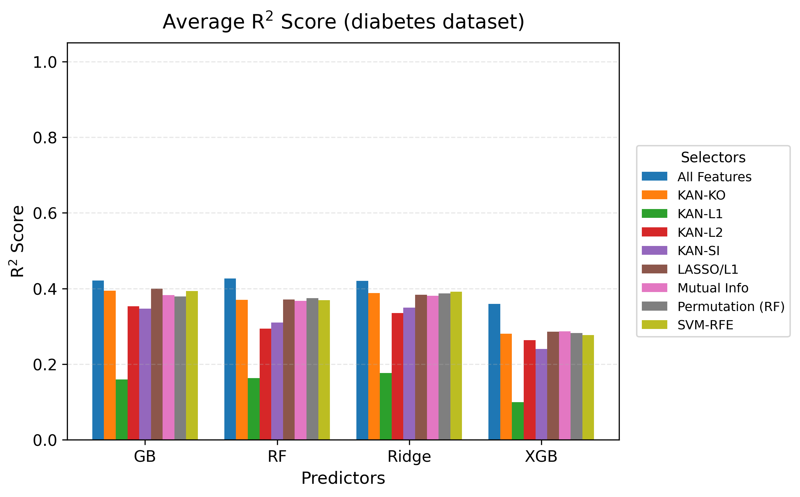
</p>

<p float="left">
  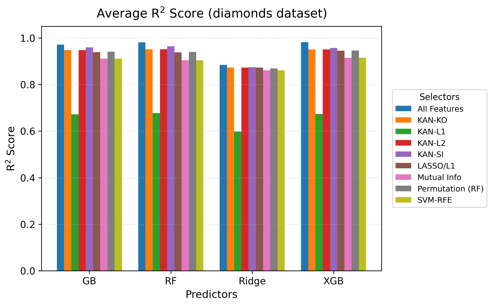
  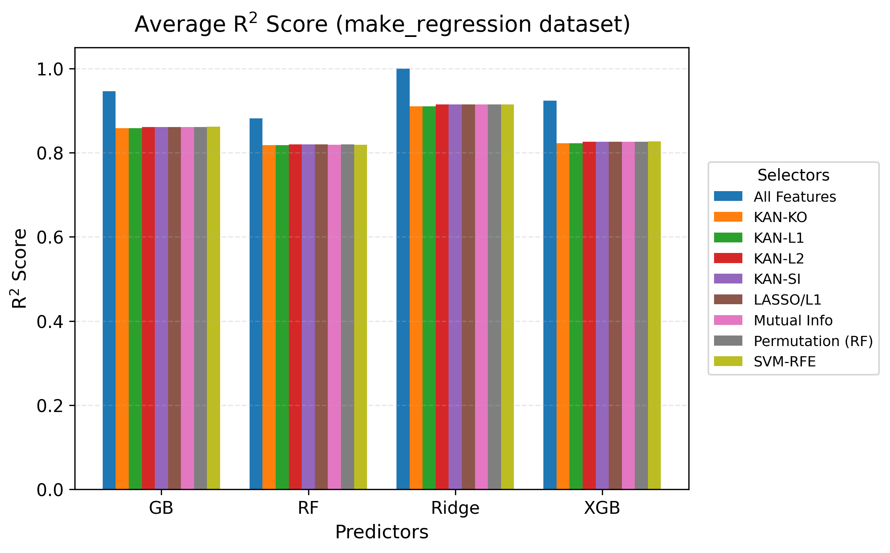
</p>

  - ### Redundancy (average pairwise correlation among selected features)
   <p float="left">
  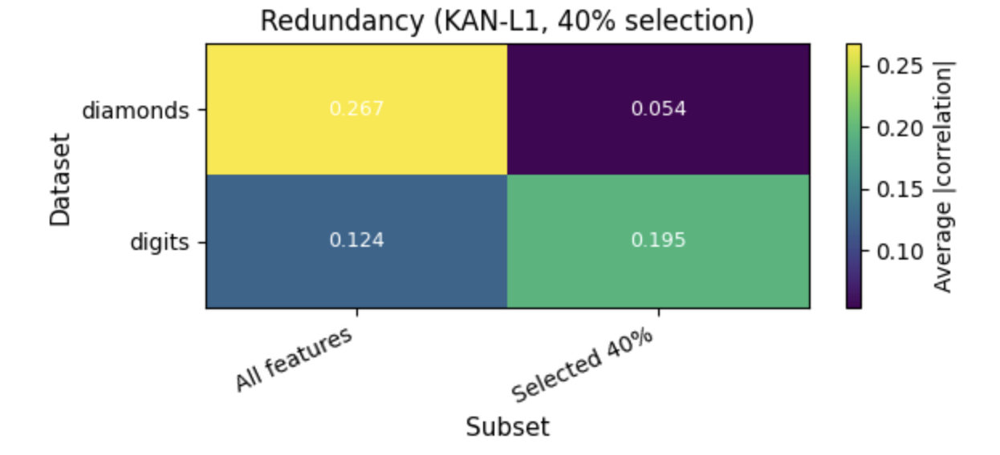
  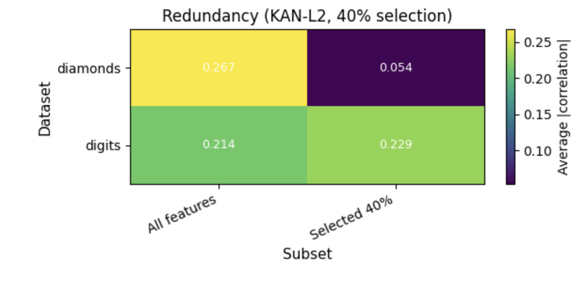
</p>
 
  - ### Stability (Jaccard similarity of selected sets across CV folds)
 <p float="left">
  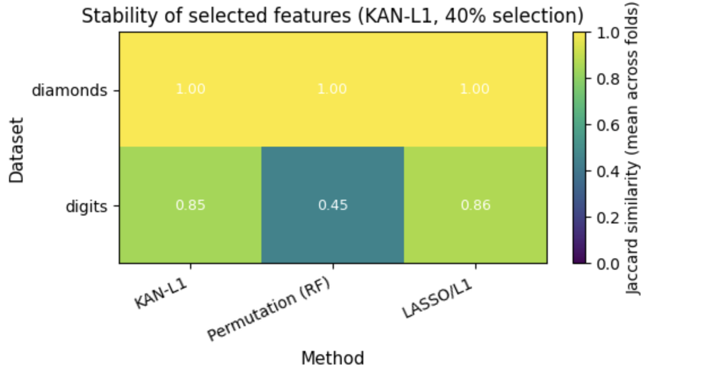
  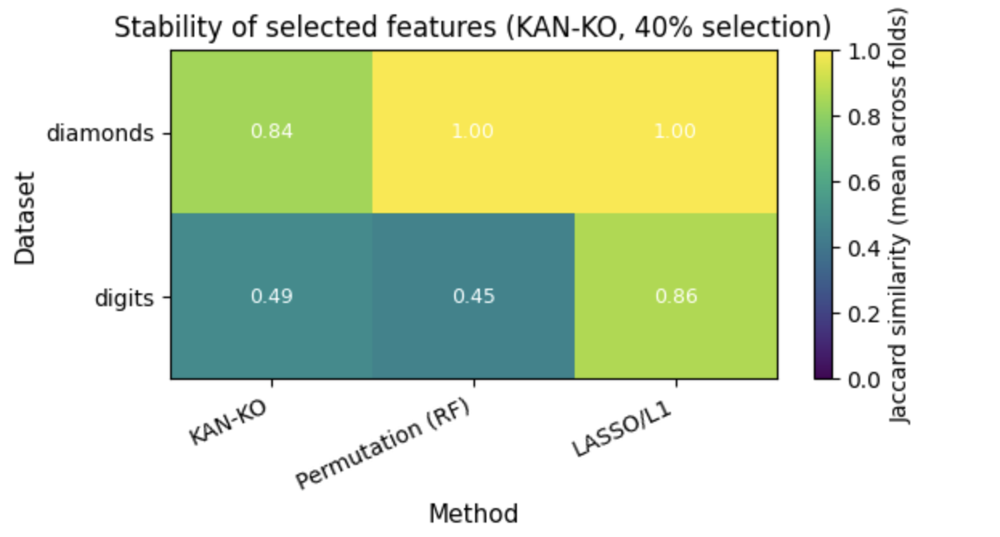 
 </p> 
 
-  ### Interpretability case study 🧠 : 1D spline responses and malignant-class logits for top-ranked features on the Breast Cancer dataset, illustrating how KAN encodes clinically meaningful patterns.
 <p float="left">
  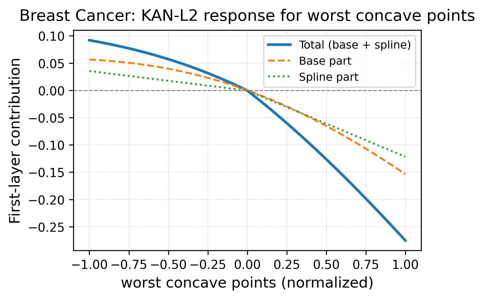
  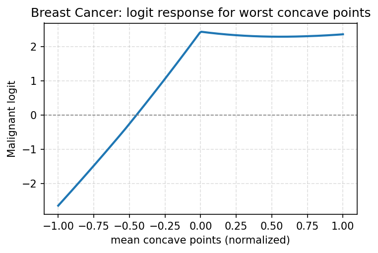 
 </p> 

- ⏱ **Runtime profiling**: Comparison of selector runtimes vs. KAN training cost, and against MI, permutation importance, and SVM-RFE.

---
## Cite This paper
``` @misc{akazan2025splinesbasedfeatureimportancekolmogorovarnold,
      title={Splines-Based Feature Importance in Kolmogorov-Arnold Networks: A Framework for Supervised Tabular Data Dimensionality Reduction}, 
      author={Ange-Clément Akazan and Verlon Roel Mbingui},
      year={2025},
      eprint={2509.23366},
      archivePrefix={arXiv},
      primaryClass={cs.LG},
      url={https://arxiv.org/abs/2509.23366},}
```

